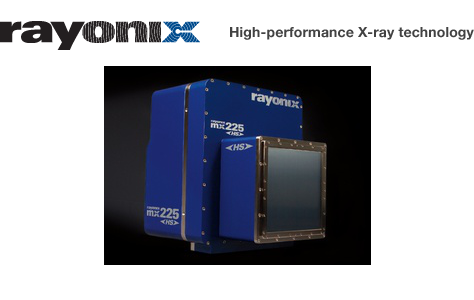

.. _camera-rayonixhs:

Rayonix HS camera
-----------------



Introduction
````````````

The MX-HS series from Rayonix incorporates the new, exclusive HS frame-transfer technology for high speed X-ray data collection without compromising resolution or data quality. The result is a new type of high speed and ultra-low noise area detector that delivers the highest performance available for X-ray diffraction applications.

The Rayonix MX-HS detectors are ideal for taking advantage of high brilliance synchrotron sources, or for any other high frame rate application. Examples include: high throughput protein crystallography, Laue diffraction, time-resolved or static small-angle X-ray scattering (SAXS), wide-angle X-ray scattering (WAXS), powder diffraction, X-ray computed tomography (CT), X-ray imaging, and coherent diffraction imaging (CDI). With no count rate limitation, these detectors are also ideal for XFEL applications.

The Lima module as been tested only with the following models :

  - MX170-HS (2x2 mdules)

Prerequisite
````````````

The Rayonix HS detector is been delivered today with its own control computer, a powerful computer embedded at leat 8GB of RAM, dual 4-Core CPU (8 cores) and a GPU card for the online image correction (background, flatfield ...).
The computer is running redhat entprise Linux 6 (64bits).

The rayonix SDK is preinstalled on the detector node under the directory ``/opt/rayonix``.

There is no special prerequisite, you can test that the device works properly by running the rayonix GUI, ``caxpure``.

Installation & Module configuration
````````````````````````````````````

Follow the generic instructions in :ref:`build_installation`. If using CMake directly, add the following flag:

.. code-block:: sh

 -DLIMACAMERA_RAYONIXHS=true

For the Tango server installation, refers to :ref:`tango_installation`.


Initialisation and Capabilities
```````````````````````````````

Implementing a new plugin for new detector is driven by the LIMA framework but the developer has some freedoms to choose which standard and specific features will be made available. This section is supposed to give you the correct information regarding how the camera is exported within the LIMA framework.

Camera initialisation
.....................

The camera has to be initialized using the RayonixHsCamera class. The default constructor does not need any input parameter.

Std capabilities
................

This plugin has been implemented in respect of the mandatory capabilites but with some limitations which are due to the camera and SDK features.  We only provide here extra information for a better understanding of the capabilities.

* HwDetInfo

  The detector is set to full image size at startup which means a binning of 1x1.

  .. note:: The recommended binning for most of the experiment is 2x2.

* HwSync

 - The minimum latency time is 1 ms.

 - The supported trigger modes are depending of the chosen frame mode. There are:

   - IntTrig
   - IntTrigMult
   - ExtTrigSingle
   - ExtTrigMult    (only for SINGLE frame mode)
   - ExtGate        (only for SINGLE frame mode)
   - ExtTrigReadout (only for FAST_TRANSFER frame mode).

Optional capabilities
.....................

* HwBin

  The supported hardware binning are 2x2, 3x3, 4x4, 5x5, 6x6, 7x7, 8x8, 9x9 and 10x10.
  By increasing the binning factor you can increase the readout speed from 2.6 fps to 140 fps which corresponds
  respectively to a pixel size of 44um and  440 um.

* HwShutter

  The Rayonix HS detectors provides 2 output channels one can choose a different source for each (see specific control parameters for more details about the output source control). For the SHUTTER source both opening and closing delay can be set.

  The Rayonix HS shutter capability only supports two modes:

   - ShutterAutoFrame
   - ShutterManual

Specific control parameters
...........................

Some specific paramaters are available within the camera hardware interface. Those parameters should be used carefully and one should refer to the camera SDK (or user's guide) documentation for a better understanding.

* get/setFrameTriggerType(type): signal type for the frame trigger input (channel #1)
* get/setSequenceGateSignalType(type): signal type for the gate input (channel #2),  The supported signal types:

 - OPTO
 - OPTO_INVERTED
 - CMOS
 - CMOS_PULLDOWN
 - CMOS_PULLUP
 - CMOS_PULLDOWN_INVERTED
 - CMOS_PULLUP_INVERTED
 - SOFTWARE

* get/setOutputSignalType(channel, type): the signal type for the output channel (CHANNEL_1 or CHANNEL_2)

* get/setOutputSignalID(channel, id): the source id for the output channel, possible sources are:

  - ID_SHUTTER
  - ID_INTEGRATE
  - ID_FRAME
  - ID_LINE
  - ID_SHUTTER_OPENING
  - ID_SHUTTER_CLOSING
  - ID_SHUTTER_ACTIVE
  - ID_TRIGGER_RISE_WAIT
  - ID_TRIGGER_RISE_ACK
  - ID_TRIGGER_FALL_WAIT
  - ID_TRIGGER_FALL_ACK
  - ID_TRIGGER_2_RISE_WAIT
  - ID_TRIGGER_2_RISE_ACK
  - ID_INPUT_FRAME
  - ID_INPUT_GATE

* get/setElectronicShutterEnabled(): active or unactive the electronic shutter
* get/setCoolerTemperatureSetpoint(): the cooler temperature set-point
* get/setSensorTemperatureSetpoint(): the sensor temperature set-point
* get/setSensorTemperature(): the detector measured temperature
* get/setCooler(): stop or start the cooler controller
* get/setVacuumValve(): close or open the vacuum valve

* get/setFrameMode(): modes are SINGLE or FAST_TRANSFER.

  .. warning:: in FAST_TRANSFER mode the latency time is disabled and it has a fixed value of 1 ms which corresponds to the readout time. In addition to this the supported trigger mode will depend on the frame mode. The list of supported trigger modes is available in this document below.

Configuration
`````````````

Cabling
.......

The detector head should be connected to the detector computer on the cameralink and USB links. You must connect the USB on the PCI board (not the motherboard ones) and the cameralink on the first channel, the top connector.

Cooling
.......

For an optimized condition wit dark current  the detector has to be cooled down, the sensor temperature set-point should be at -120 deg and the cooler temperature set-point at -90 deg Celsuis. And of course the cooler controller should be started.

How to use
``````````

This is a simple python test program:

.. code-block:: python

  from Lima import RayonixHs
  from lima import Core

  cam = RayonixHs.Camera()
  hwint = RayonixHs.Interface(cam)
  control = Core.CtControl(hwint)

  acq = control.acquisition()

  # configure some hw parameters
  sens_temp = hwint.getSensorTemperature()
  cool_temp = hwint.getCoolerTemperatureSetpoint()
  if sens_temp > -50:
    print " Hoops, detector is not cooled down, temp = ", sens_temp

  # setting new file parameters and autosaving mode
  saving=control.saving()

  pars=saving.getParameters()
  pars.directory='/somewhere/'
  pars.prefix='test1_'
  pars.suffix='.edf'
  pars.fileFormat=Core.CtSaving.EDF
  pars.savingMode=Core.CtSaving.AutoFrame
  saving.setParameters(pars)

  # set a new binning to increase the frame rate
  image = control.image()
  image.setBin(Core.Bin(2,2))

  # now ask for 10ms sec. exposure and 100 frames
  acq.setAcqExpoTime(0.01)
  acq.setAcqNbFrames(100)

  control.prepareAcq()
  control.startAcq()

  # wait for last image (#xi99) ready
  lastimg = control.getStatus().ImageCounters.LastImageReady
  while lastimg !=99:
    time.sleep(1)
    lastimg = control.getStatus().ImageCounters.LastImageReady

  # read the first image
  im0 = control.ReadImage(0)
